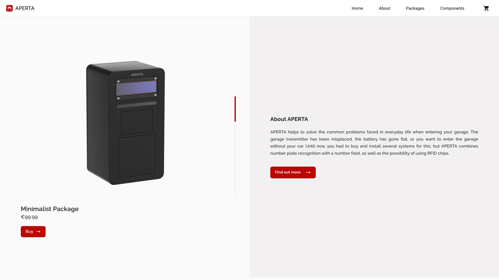

<!-- Project Logo -->
# APERTA
**Diplomarbeit 2021/2022** 
**Projekt-Team:** Koll Simon, Golic Benjamin, Hauser David

## Web-Shop

<!-- Table of Contents -->

<!-- Description -->
## Beschreibung
APERTA helps to solve the common problems faced in everyday life when entering your garage. It combines number plate recognition with a number field, as well as the possibility of using RFID chips. The number plate recognition takes a picture of the surroundings, searches for the number plate on it, and if it has been added beforehand via the user interface, the garage door is activated and you can enter.

## Technologien
* [Angular](https://angular.io)
* [React](https://reactjs.org)
* [Commerce.js](https://commercejs.com)
* [Stripe](https://stripe.com/)
* [Python](https://www.python.org)
* [Docker](https://www.docker.com)
* [OpenCV](https://opencv.org)
* [Keycloak](https://www.keycloak.org)
* [Oracle-Cloud-VM](https://www.oracle.com/cloud/compute/virtual-machines/)
* [LeoCloud](https://cloud.htl-leonding.ac.at/)
